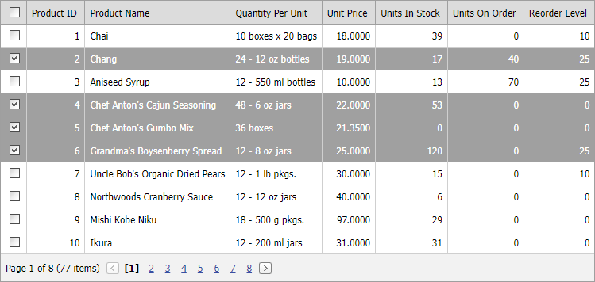

<!-- default badges list -->
[](https://supportcenter.devexpress.com/ticket/details/E1559)
[](https://docs.devexpress.com/GeneralInformation/403183)
<!-- default badges end -->

# Grid View for ASP.NET Web Forms - How to use ASPxCheckBox in DataItemTemplate to implement a selection column
<!-- run online -->
**[[Run Online]](https://codecentral.devexpress.com/e1559/)**
<!-- run online end -->

This example demonstrates how to emalate the [selection](https://docs.devexpress.com/AspNet/3737/components/grid-view/concepts/focus-and-navigation/selection) behavior in [ASPxGridView](https://docs.devexpress.com/AspNet/DevExpress.Web.ASPxGridView) control.



## Implementation Details

The [DataItemTemplate](https://docs.devexpress.com/AspNet/DevExpress.Web.GridViewDataColumn.DataItemTemplate) contains a [ASPxCheckBox](https://docs.devexpress.com/AspNet/DevExpress.Web.ASPxCheckBox) control. The [CheckedChanged](https://docs.devexpress.com/AspNet/DevExpress.Web.ASPxCheckBox.CheckedChanged) event handler calls the [SelectRowOnPage](https://docs.devexpress.com/AspNet/js-ASPxClientGridView.SelectRowOnPage(visibleIndex)) method to selecn or deselect the corresponding row.

```aspx
<dx:GridViewDataTextColumn Caption="#" >
    <DataItemTemplate>
        <dxe:ASPxCheckBox ID="cbCheck" runat="server" AutoPostBack="false" OnLoad="cbCheck_Load" />
    </DataItemTemplate>
    ...
</dx:GridViewDataTextColumn>
```

```cs
protected void cbCheck_Load(object sender, EventArgs e) {
    ...
    cb.ClientSideEvents.CheckedChanged = String.Format("function (s, e) {{ grid.SelectRowOnPage ({0}, s.GetChecked()); }}", container.VisibleIndex);
}
```

The [HeaderTemplate](https://docs.devexpress.com/AspNet/DevExpress.Web.GridViewColumn.HeaderTemplate) contains a [ASPxCheckBox](https://docs.devexpress.com/AspNet/DevExpress.Web.ASPxCheckBox) control to implement _select all_ functionality. For this check box, the [CheckedChanged](https://docs.devexpress.com/AspNet/DevExpress.Web.ASPxCheckBox.CheckedChanged) event handler calls [SelectAllRowsOnPage](https://docs.devexpress.com/AspNet/js-ASPxClientGridView.SelectAllRowsOnPage) method to to selecn or deselect all grid rows.

```aspx
<dx:GridViewDataTextColumn Caption="#" >
    ...
    <HeaderTemplate >
        <dxe:ASPxCheckBox ID="SelectAllCheckBox" runat="server" ToolTip="Select/Unselect all rows on the page"
            ClientSideEvents-CheckedChanged="function(s, e) { grid.SelectAllRowsOnPage(s.GetChecked()); grid.PerformCallback(); }" />
    </HeaderTemplate>
</dx:GridViewDataTextColumn>
```

## Files to Review

* [Default.aspx](./CS/WebSite/Default.aspx) (VB: [Default.aspx](./VB/WebSite/Default.aspx))
* [Default.aspx.cs](./CS/WebSite/Default.aspx.cs) (VB: [Default.aspx.vb](./VB/WebSite/Default.aspx.vb))
